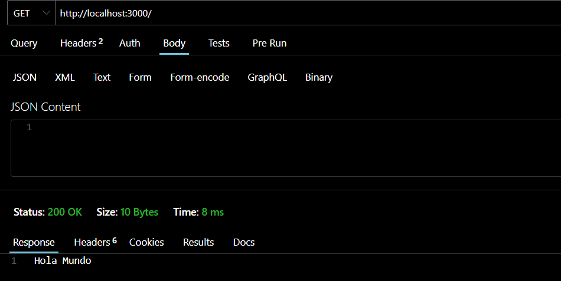
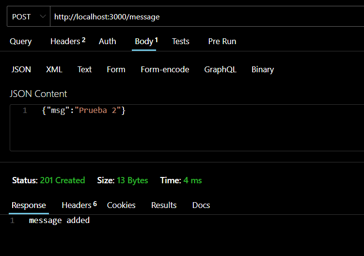
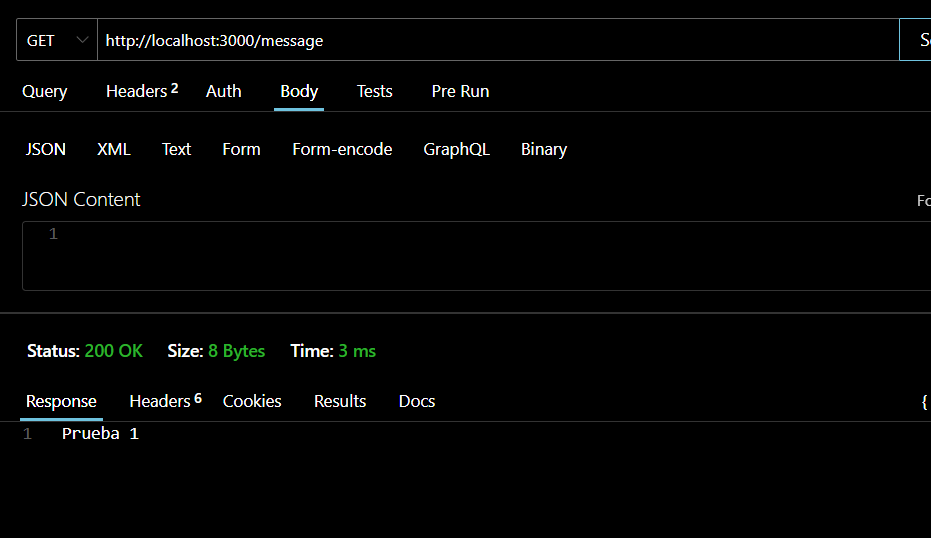
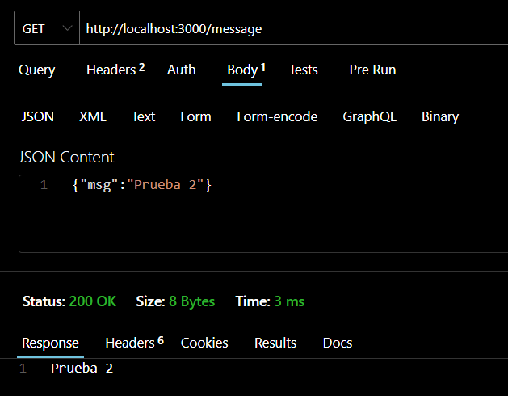
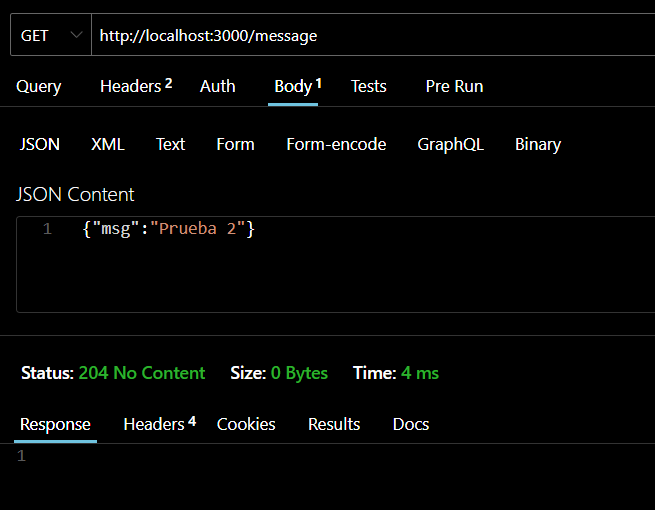

# Desafio Implementación de un Middleware en entorno Javascript
## Daniel_Rojas

### Instalacion de PNPM
Para iniciar el proyecto se debe instalar pnpm

En powershell 
```bash
 $env:PNPM_VERSION = "10.0.0"; Invoke-WebRequest https://get.pnpm.io/install.ps1 -UseBasicParsing | Invoke-Expression
```
o con npm 
```bash
npm install -g pnpm@latest-10
```

### Paquetes instalados
Para producción

```bash
pnpm i express cookie-parser morgan
```

Para desarrollo
```bash
pnpm i --save-dev  tsx
pnpm i --save-dev   @types/express @types/node @types/morgan @types/cookie-parser

```
Para ejecutar 

```bash
pnpm run dev
```


Metodo Get Token
```bash
http://localhost:3000/
```


con error


con error forzado


Prueba de la lista











